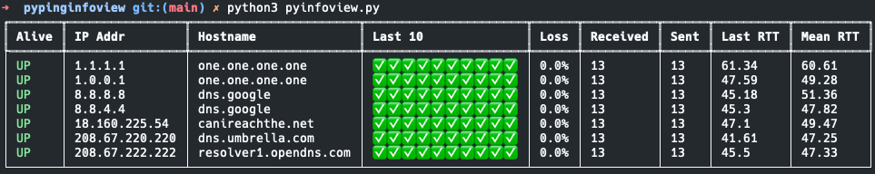

A console-based python ping tool, inspired by NirSoft [PingInfoView](https://www.nirsoft.net/utils/multiple_ping_tool.html)


This is a rough, hacked together version that has pretty poor performance - but gets the job done. 



**WSL Users** - see icmplib docs on ICMP without root [https://github.com/ValentinBELYN/icmplib/blob/main/docs/6-use-icmplib-without-privileges.md](https://github.com/ValentinBELYN/icmplib/blob/main/docs/6-use-icmplib-without-privileges.md)

```
$ echo 'net.ipv4.ping_group_range = 0 2147483647' | sudo tee -a /etc/sysctl.conf
$ sudo sysctl -p
```


TODO: 
- async ping
- better data structure (SQLite)?
- ~~text file input~~
- ~~IP/DNS lookup~~
- ~~set ping interval via cli~~
